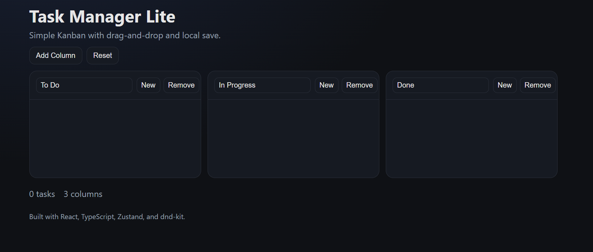

# Task Manager Lite

Simple, fast Kanban board built with **React + TypeScript + Zustand + dnd-kit**.  
Create, edit, and drag tasks between columns. State persists in `localStorage`.

## 📸 Screenshot




## ✨ Features
- Drag & drop reordering and column moves
- Create / edit / delete tasks
- Add / rename / remove columns
- Persistent state (localStorage)
- Clean, responsive UI (no heavy UI framework)

## 🧰 Tech Stack
- React + TypeScript (Vite)
- Zustand (state, with persistence)
- dnd-kit (drag & drop)

## 🚀 Getting Started
```bash
npm install
npm run dev
```

## Cloud Backups
1. Create a `.env` file in the project root and add your API key:
   ```
   VITE_BACKUP_API_KEY=your-secret-key
   ```
2. (Optional) Override the API base URL if you are testing against a different host:
   ```
   VITE_BACKUP_API_BASE=https://api.anthonychiappone.com
   ```
3. Restart the dev server after editing environment variables.
4. Use the **Save to Cloud** / **Restore from Cloud** buttons inside the board toolbar. The app automatically pulls the latest backup on initial load and performs a debounced auto-backup (about every 90 seconds) while you make changes.
